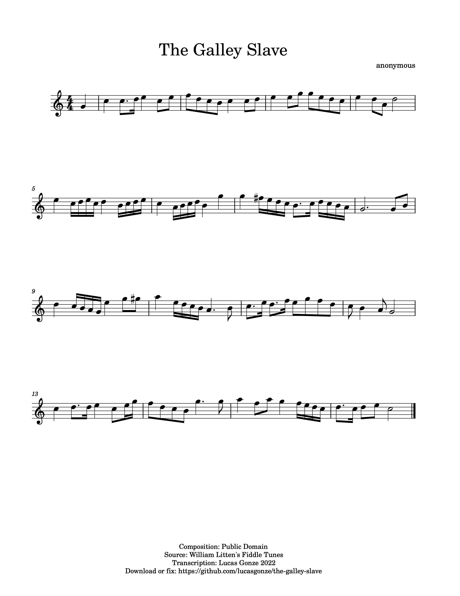

This repository contains my digital transcription of a song I encountered in a book titled "William Litten's Fiddle Tunes: 1800-1802." The book was published in 1977 in Vineyard Haven, Massachusetts by Hines Point Publishers, and is now out of print. I have searched for the book online, but there are no digitized scans and the original had only a single small run. 

Litten was a sailor whose duties included fiddling. He kept a notebook of tunes. His notebook wound up in a historical archive in a library in the [Nantucket, Massachusetts](https://en.wikipedia.org/wiki/Nantucket#The_whaling_industry).  The researcher who compiled the Hines Book book was Gale Huntington. I came across this book in the back stacks of a sheet music store in Boston around 1982.

Out of the many songs in this book that I have played, this one is easily the best. Its structure is uneven and varied without being crooked - he pulls phrases across bar lines to the point where the meter is almost 6/4 rather than 4/4, and then evens out the counts to maintain a danceable cadence. He has a constant stream of ideas; he never just takes a theme and morphs it through a common series of transformations. Because there is so much detail I suspect this is an original composition. 

It's not hard to play. Actually, it's pretty easy, as long as you don't go too fast. What's hard is absorbing the quirks and irregularities. It's like a hand-made woodcut. No circle is perfectly round, no line is perfectly straight, no pattern is perfectly repeated, nothing is predictable. 

Regarding the title of the song, I never play this music without wondering who Litten was thinking of. As a working seaman, he was personally acquainted with many [people enslaved into the galley](https://en.wikipedia.org/wiki/Galley_slave). Did he meet someone's eyes? 

I hope that my digital version of this music will keep it alive for future players in the same way that Huntington's version of Litten's original kept it alive for me.

