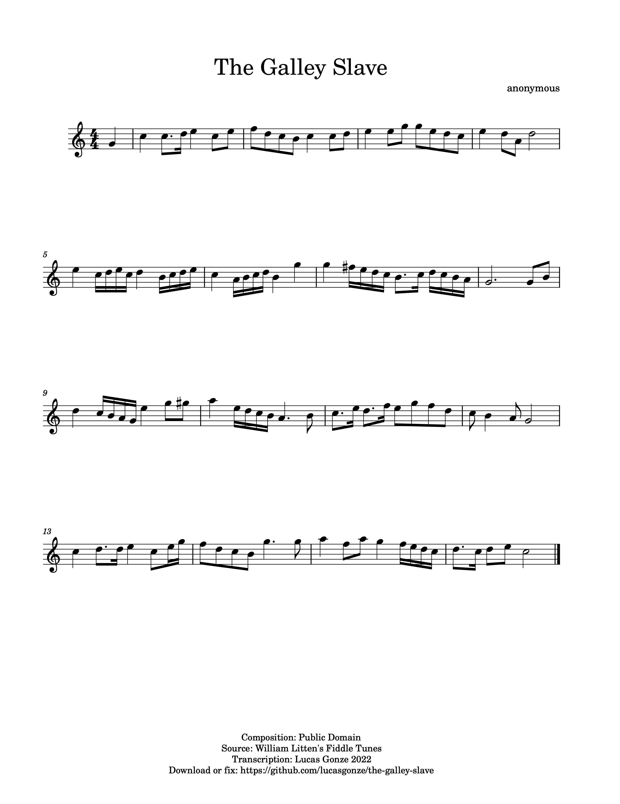

## Why I Made This Sheet Music

This repository contains my digital transcription of a song in a book titled "William Litten's Fiddle Tunes: 1800-1802." The book was published in 1977 in Vineyard Haven, Massachusetts, by Hines Point Publishers. As far as I can tell the original had only a single run, maybe self-published by a company that only produced this one title. I came across it in the back stacks of a sheet music store in Boston ("The Beehive: Jazz Hive - No Jive!") around 1982. 

Since then my copy has become badly worn. There seems to be no alternative to it. It's out of print, so I can't buy a new copy. There appear to be no digitized scans, though several academic libraries appear to have listings of hard copy versions. Letting this disappear seems wrong to me. This knowledge and these sounds shouldn't be lost. 

Huntington's publication of Litten's hand-written original kept it alive for me. I hope that my digital version here will do the same for others. 

## Musicology

Litten was a sailor whose duties included fiddling. He kept a notebook of tunes. His notebook wound up in a historical archive in a library in [Nantucket, Massachusetts](https://en.wikipedia.org/wiki/Nantucket#The_whaling_industry). The researcher who compiled the Hines Book book was Gale Huntington.

Out of the many songs in this book that I have played through, this one is easily the best. Its structure is uneven and varied without being crooked. Litten pulls phrases across bar lines to the point where the meter is almost 6/4 rather than 4/4, then pads the beat counts to maintain a danceable cadence. He has a constant stream of ideas: he never takes a motif and morphs it through a conventional series of transformations. Because there is so much detail I suspect this is an original composition. 

It's not hard to play. What's hard is absorbing the quirks and irregularities. It's like a hand-made woodcut. Everything feels natural to the ear, yet no curve is perfectly round, no line is perfectly straight, no pattern repeats, nothing is predictable.

Regarding the title of the song, I never play this music without wondering who Litten was thinking of. As a working seaman, he was on board with [people enslaved into the galley](https://en.wikipedia.org/wiki/Galley_slave). Did he meet someone's eyes?

## Playing It Yourself

The [generated](generated) directory contains auto-generated versions of that source in visual formats for playing, audio formats for previewing, and MIDI for remixing. The formats include formatted as JPEG, PNG, SVG, FLAC, MIDI, MP3, MusicXML, PDF, and WAV. 

## Contributions

To modify my source file, grab [The_Galley_Slave.mscz](The_Galley_Slave.mscz)

I created this transcription using a program called MuseScore 3. 

> MuseScore is an open source and free music notation software. For support, contribution, bug reports, visit MuseScore.org. Fork and make pull requests! 

It is free software under the terms of the GPL Version 3. MuseScore is on Github at https://github.com/musescore/MuseScore.

I love hearing what other people create based on my work - let me know!

 # Copyright Status

 Although I am confident my transcription and distribution of this work would pass a fair use challenge, it would be good to simply put the entire book under a permissive license. In hopes of convincing the rights holder to do that I attempted to find them. These are the facts that I discovered. 

1. The original publication was in 1977 in the state of Massachusetts. 

2. The author, Elon Gale Huntington, died in 1993 in Massachusetts. [Obituary](https://www.ancestry.com/genealogy/records/elon-gale-huntington-24-2sf9dg).

3. Rights probably passed to the author's wife, Mildred Tilton Huntington. She died in 2003 in Massachusetts. [Record on Find-a-Grave](https://www.findagrave.com/memorial/185317603/mildred-aurelia-huntington).

4. Rights probably passed to the author's child, Emily Huntington Rose. She died in 2013 in Massachusetts. [https://www.findagrave.com/memorial/192476433/emily-rose](https://www.findagrave.com/memorial/192476433/emily-rose)

5. Rights would have passed to author's grandchildren, but I found no record of Emily Huntington Rose having children. 

6. Rights could conceivably has passed to siblings of Mildred Tilton Huntington, but there were none. 
 
The above concerns Gale Huntington's copyright. My own copyrights on this repository are under the Creative Commons CC0 Public Domain Dedication. 

You do not need my permission to use my work. If I am unavailable to grant you permission, you should proceed. However I cannot grant you permissions to Gale Huntington's work.

